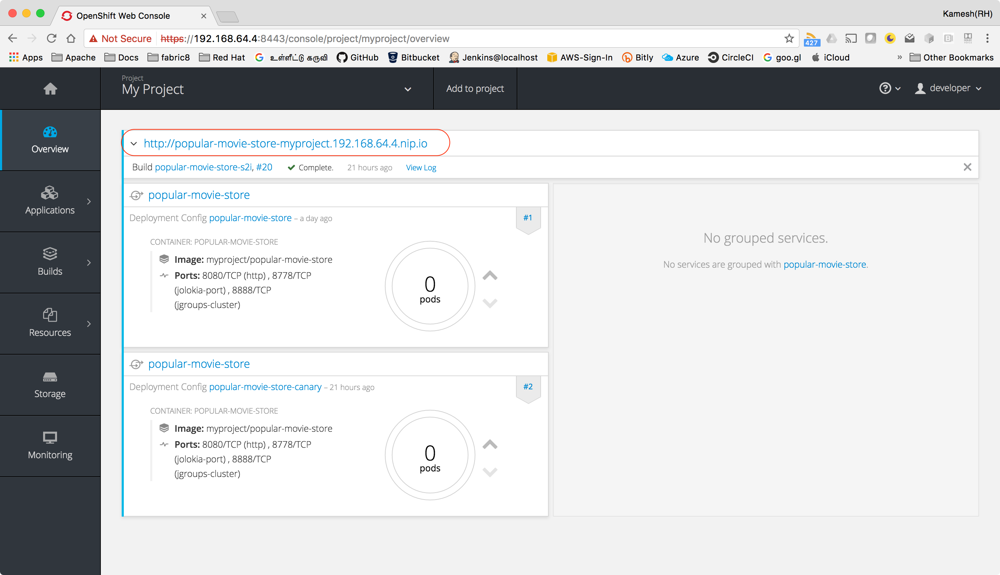

:toc: macro

= Popular Movie Store

toc::[]

== Overview

A simple https://projects.spring.io/spring-boot/[Spring Boot] based shopping cart application that will demonstrate,

* Stateful application re-deployments on https://kubernetes.io[Kubernetes] (or) https://www.openshift.com/[OpenShift]
* Using http://infinispan.org/[Infinispan] with https://projects.spring.io/spring-boot/[Spring Boot] for HTTP session caching
and management
* Seamless https://martinfowler.com/bliki/CanaryRelease.html[canary releases] with out the user loosing the state

== Setup Local Kubernetes Cluster

The kubernetes cluster can be set locally using

* https://github.com/kubernetes/minikube[minikube]

(OR)

* https://github.com/minishift/minishift[minishift]


== Adding role to Service Account

infinispan-cloud uses KUBE_PING to query the Kube API for nodes, pods and labels we need to add permissions, hence the
service account associated with the deployment need to be added with the required roles to allow infinispan to query  kubernetes
API.

This application uses a service account called *popular-movie-store* to run the pod, the service account
*popular-movie-store* should be given __view__ permissions to use Kube API.

Typically we do the following on OpenShift to add the role to the user,

[source, sh]
----
oc policy add-role-to-user view system:serviceaccount:$(oc project -q):default -n $(oc project -q)  # <1>

oc policy add-role-to-user view system:serviceaccount:$(oc project -q):popular-movie-store -n $(oc project -q) # <2>
----

<1> Adds view role to *default* service account
<2> Adds view role to *popular-movie-store* service account

Since we use fabric8 maven plugin we have automated this step, using the link:./src/main/fabric8/rb.yml[rb.yml] resource


== API Key

You need the themoviedb API key for running the application, you can get one from
https://www.themoviedb.org/documentation/api[themoviedb].

Once you have the API key from https://www.themoviedb.org/documentation/api[themoviedb], generate a base64 encoded value of it,

[source, sh]
----
echo -n '<your-api-key>' | openssl base64
----

[[app-deployment]]
== Deploying

Assuming you having a running Kubernetes cluster, execute the following command to deploy the application,

[source, sh]
----
./mvnw  -DapiKey=<api-key> clean fabric8:deploy #<1>

./mvnw -Pcanary clean -DapiKey=<api-key> clean fabric8:deploy #<2>
----

<1> The *fabric8:deploy* will trigger deployment of manifests in Kubernetes cluster
<2> The application is configured with maven profile called *canary* link:./pom.xml[pom.xml], which aids in performing
the https://martinfowler.com/bliki/CanaryRelease.html[Canary Releases]

[TIP]
====

Everytime you do *fabric8:deploy* all resources are recreated this could be an issue with services as *nodePort* will
refreshed on every deployment, to avoid that just add `-Dfabric8.deploy.ignoreServices` when doing re-deployments.

====

NOTE: The build will take some time for the very first deployment, as bunch of images needs to be pulled.

[[accessing-app]]
== Accessing the Application

Once the application is deployed in Kubernetes you can access the application with one of the following ways

If you are using `minikube` you can open the application in the browser using the command `minikube
service popular-movie-store`

(OR)

If you are using `minishift` you can OpenShift console in the browser using the command `minishift
console` and find the application url from the console refer to screenshot below

[.right.text-center]


==== Sessions API

The core idea of the demo is to see if my sessions stand with rolling upgrade of the applications, to know your current
sessions you can access the url http://<application-url>/sessions, which will return the JSON of the currently active
sessions, where the application url is the same one from <<accessing-app>>

[[app-undeploy]]
== Undeploying

The application can be undeployed using the following <<tools,fabric8-maven-plugin>> goals,

=== Normal release

[code,sh]
----
./mvnw  -DapiKey=<api-key> fabric8:undeploy
----

=== Canary Release

```
./mvnw -Pcanary -DapiKey=<api-key> fabric8:undeploy
```

[[app-pipelines]]
== Pipelines

The application is enabled for OpenShit CI/CD via Jenkins. Fork your the project to your user id 
and then,

* Login to the OpenShift server using `oc login`, please make sure you login with user who can has 
cluster admin role to enable creation of github secrets
* From the Project root do `mvn fabric8:import`
* You will now see the Buid Config for the project created in Github 
* To get the GitHub webhook url run the command `oc describe bc/popular-moive-store`
* Add the GitHub WebHook url displayed in https://developer.github.com/webhooks/[GitHub Web Hook] settings

You are now all set to trigger the pipelines via GitHub pushes.

NOTE: Automatic builds for GitHub will work only if the project is reachable via internet otherwise
you need to start the builds manually

== Utilities and Tools

=== Applications

The following applications are very handy for development, and its purely optional to have them
installed to the kubernetes environment, they are available at http://fabric8.io/manifests/kubernetes.html[Kubernetes]
or http://fabric8.io/manifests/openshift.html[OpenShift] for respective environments

* https://github.com/fabric8io/exposecontroller[exposecontroller] - a utility that can exposes the service automatically when it the manifests has
label `expose:true`

* https://github.com/fabric8io/configmapcontroller[configmapcontroller] - a utility that does a rebounce of the pod when the configmap mentioned in the annotation of the
deployment changes

[[tools]]
=== Tools
* https://fmp.fabric8.io[fabric8-maven-plugin]
* http://hawt.io/[hawtio]
* https://stedolan.github.io/jq/[jq]
* https://github.com/0k/shyaml[shyaml]

== Disclaimer

This demo application uses https://www.themoviedb.org[MovieDB] API for getting some movie posters. All data displayed in the demo is only used for demonstrates various features of the demo and teaching.

== License

Copyright 2017 Red Hat

Licensed under the Apache License, Version 2.0 (the "License");
you may not use this file except in compliance with the License.
You may obtain a copy of the License at

   http://www.apache.org/licenses/LICENSE-2.0

Unless required by applicable law or agreed to in writing, software
distributed under the License is distributed on an "AS IS" BASIS,
WITHOUT WARRANTIES OR CONDITIONS OF ANY KIND, either express or implied.
See the License for the specific language governing permissions and
limitations under the License.